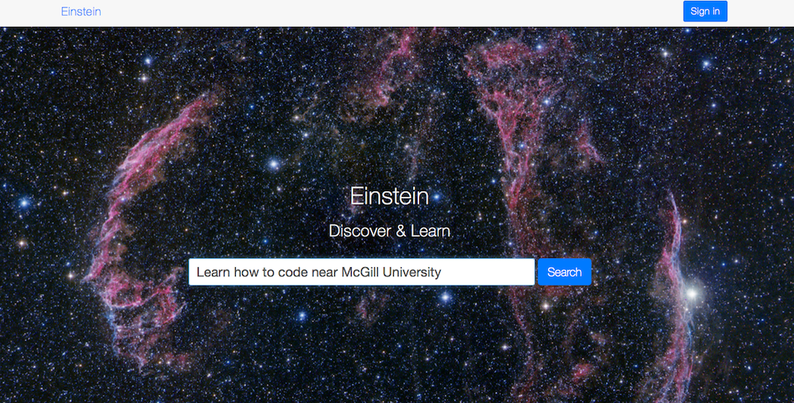

Einstein
========

 
 
 
 
 

### What

### Why

### Tech Stack

### Notes

- Place repo in (OS X) - /Applications/MAMP/htdocs/Einstien
- Make a symlink to it

```bash
ln -s /Applications/MAMP/htdocs/Einstien <LINK_DIR>
```
