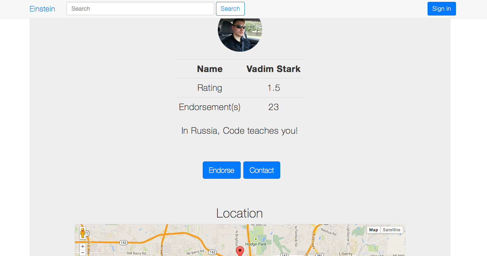

Einstein
========

 
 
 
 
 

### What

### Why

### Tech Stack

- [Bootstrap iOS7](http://jasonbradley.me/bootstrap-ios7/)

### Notes

- Place repo in (OS X) - /Applications/MAMP/htdocs/Einstien
- Make a symlink to it

```bash
ln -s /Applications/MAMP/htdocs/Einstien <LINK_DIR>
```

- Landing page image source - http://www.flickr.com/photos/terryhancock/9210242042/
